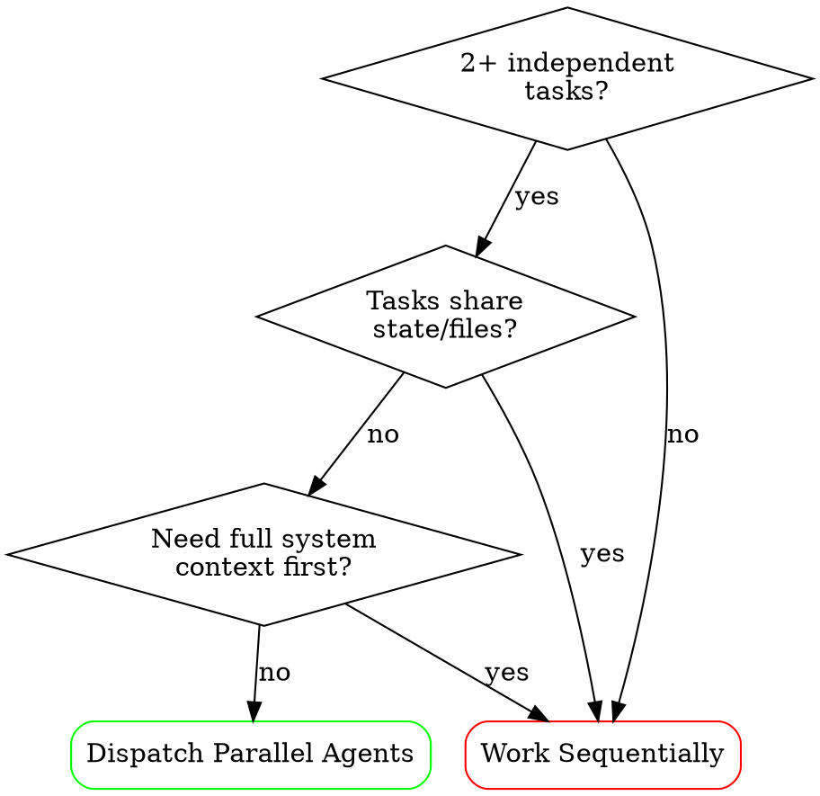

# Dispatching Parallel Agents

## Overview

When you have multiple unrelated failures or tasks (different test files, different subsystems, different bugs), investigating them sequentially wastes time. Each investigation is independent and can happen in parallel.

**Core principle:** Dispatch one agent per independent problem domain. Let them work concurrently.

## When to Use



**Use when:**
- 3+ test files failing with different root causes
- Multiple subsystems broken independently
- Each problem can be understood without context from others
- No shared state between investigations

**Don't use when:**
- Failures are related (fix one might fix others)
- Need to understand full system state first
- Agents would edit the same files

## The Pattern

### 1. Identify Independent Domains

Group failures by what's broken:
- File A tests: Tool approval flow
- File B tests: Batch completion behavior
- File C tests: Abort functionality

Each domain is independent — fixing tool approval doesn't affect abort tests.

### 2. Create Focused Tasks

Each parallel task gets:
- **Specific scope:** One test file or subsystem
- **Clear goal:** Make these tests pass
- **Constraints:** Don't change other code
- **Expected output:** Summary of what you found and fixed

### 3. Dispatch and Review

Open separate Copilot chat sessions per task (or use Copilot's agent mode with `@workspace` focused on each subsystem). When all complete:
- Read each summary
- Verify fixes don't conflict
- Run full test suite
- Integrate all changes

## Agent Prompt Structure

Every agent dispatch should include these sections:

```
## Context
[What the agent needs to know about the codebase/problem]

## Task
[Specific, actionable description of what to do]

## Constraints
- Don't modify files outside <scope>
- Follow TDD: write failing test first
- Don't refactor unrelated code

## Expected Output
[What the agent should return when done]
- Summary of root cause
- What was changed and why
- Test results
```

### Example

```
## Context
The retry module (src/retry/) handles transient failures in API calls.
Tests in src/retry/retry.test.ts are failing.

## Task
Fix the 3 failing tests in src/retry/retry.test.ts:
1. "should retry failed operations 3 times" — expects 3 attempts, gets 1
2. "should respect backoff delay" — timing assertion off by 200ms
3. "should not retry on permanent errors" — retries when it shouldn't

## Constraints
- Only modify files in src/retry/
- Follow TDD for any new behavior
- Don't change the public API of retryOperation()

## Expected Output
- Root cause of each failure
- What you changed and why
- All tests passing (show output)
```

## Common Mistakes

**Too broad:** "Fix all the tests" — agent gets lost
**Specific:** "Fix agent-tool-abort.test.ts" — focused scope

**No context:** "Fix the race condition" — agent doesn't know where
**Context:** Paste the error messages and test names

**No constraints:** Agent might refactor everything
**Constraints:** "Do NOT change production code" or "Fix tests only"

**Overlapping scope:** Two agents editing the same files
**Fix:** Ensure each agent has exclusive file ownership

**Missing expected output:** Agent does work but doesn't report what matters
**Fix:** Always specify what the summary should include

## Verification

After all parallel tasks return:
1. **Review each summary** — Understand what changed
2. **Check for conflicts** — Did agents edit same code?
3. **Run full suite** — Verify all fixes work together
4. **Spot check** — Agents can make systematic errors
5. **Integration test** — Changes that pass individually may conflict together

## When NOT to Use

- Related failures (fix one might fix others — investigate together first)
- You don't know what's broken yet (exploratory debugging first)
- Agents would edit the same files (shared state = conflicts)
- Problem requires understanding full system flow (one agent, sequential)
- Fewer than 3 independent tasks (overhead not worth it)

## Real Example from a Session

```
Session state: 47 test failures across 5 files after a refactor

Analysis:
- agent-tool-abort.test.ts (3 failures): Timing issues in abort handling
- batch-completion.test.ts (12 failures): New batch API not implemented
- tool-approval.test.ts (8 failures): Permission model changed
- streaming.test.ts (15 failures): Buffer handling regression
- config.test.ts (9 failures): New config schema not reflected

Dispatch plan:
- Agent 1: agent-tool-abort.test.ts (timing)
- Agent 2: batch-completion.test.ts (new API)
- Agent 3: tool-approval.test.ts (permissions)
- Agent 4: streaming.test.ts (buffers)
- Agent 5: config.test.ts (schema)

Result: 47/47 failures resolved in parallel, no conflicts
(Sequential would have taken 5x longer)
```

## Key Benefits

- **Speed:** N problems solved in time of 1 (the slowest)
- **Focus:** Each agent has narrow scope, fewer mistakes
- **Isolation:** Failures in one agent don't block others
- **Clarity:** Each summary is self-contained and reviewable

## Integration

**Pairs with:**
- `/systematic-debugging` — Use within each agent for root cause analysis
- `/subagent-driven-development` — Similar pattern but for planned tasks, not failures
- `/verification-before-completion` — Verify each agent's work independently
