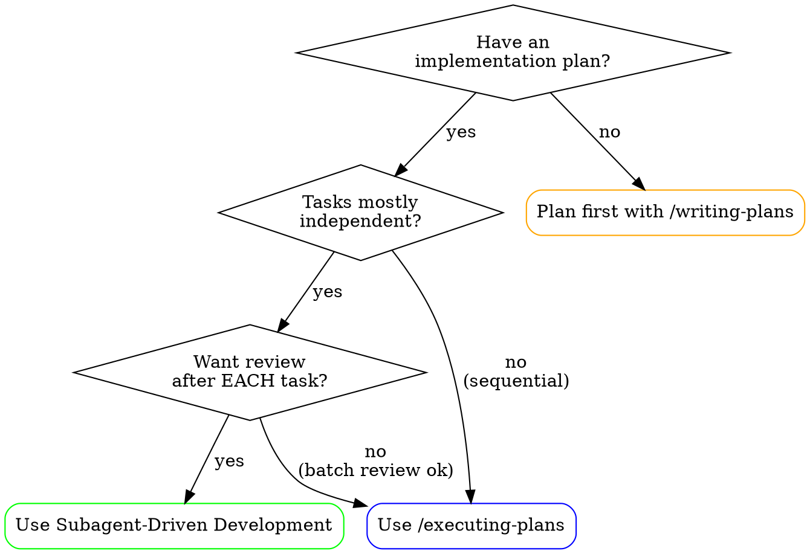
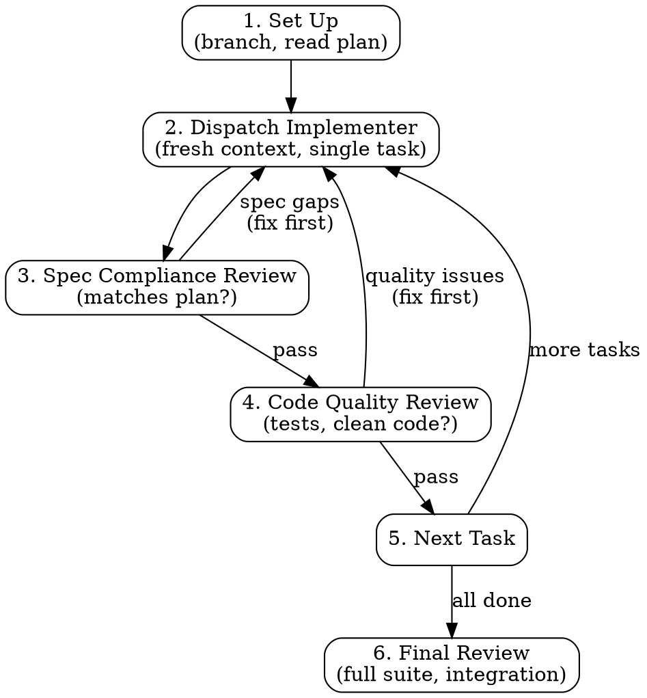

# Subagent-Driven Development

Execute a plan by giving each task fresh context, with a two-stage review after each: spec compliance first, then code quality.

**Core principle:** Fresh context per task + two-stage review (spec then quality) = high quality, fast iteration.

## When to Use



**Use when:**
- You have an implementation plan with mostly independent tasks
- You want review checkpoints after each task (not just end)
- You want to catch spec gaps before building the next task on top

**vs. `/executing-plans`:**
- Subagent-driven: review after EACH task, fresh context per task
- Executing-plans: review after each batch of 3, same context throughout

## The Process



### 1. Set Up

```bash
# Ensure you're on a feature branch, not main
git checkout -b feature/<name>
```

Read the plan once. Extract all tasks and their full text. Note any shared context that tasks depend on.

### 2. For Each Task

**a. Dispatch implementer with fresh context**

Start a new Copilot chat (or use `/new`). Provide:
- The task description and steps (from the plan)
- The relevant surrounding context (don't make it read the whole plan)
- Constraints: "Follow TDD, commit after each step"

**b. Spec compliance review**

Before moving on, check: does the implementation match what the plan specified?

Use `/requesting-code-review` and check specifically:
- [ ] All requirements from the task are implemented
- [ ] Nothing extra was added (YAGNI)
- [ ] No placeholders or TODOs left unresolved

If spec gaps found → fix them before continuing.

**c. Code quality review**

After spec compliance passes:
- [ ] Tests exist and are real (not testing mocks)
- [ ] No magic numbers, dead code, swallowed errors
- [ ] Implementation is clean and minimal

If quality issues found → fix them, re-review, then continue.

**d. Mark complete and move on**

Only when both reviews pass → move to next task.

## Model Selection

When dispatching implementer agents, consider the task complexity:

- **Simple/mechanical tasks** (rename, move, update imports): Standard agent, tight constraints
- **Complex logic tasks** (algorithms, state machines, concurrency): Give more context, allow more exploration
- **Integration tasks** (connecting subsystems): Provide both subsystem contexts, emphasize interface contracts

Match the context you provide to the task complexity. Over-constraining complex tasks leads to poor solutions. Under-constraining simple tasks leads to scope creep.

## Handling Implementer Status

When an implementer completes (or gets stuck), they should report one of:

### DONE
All requirements met, tests pass. Proceed to spec compliance review.

### DONE_WITH_CONCERNS
Implementation complete but implementer flagged potential issues:
- Review the concerns during spec compliance
- Decide if concerns are in-scope or deferred
- Document deferred concerns

### NEEDS_CONTEXT
Implementer couldn't proceed — missing information:
- Provide the missing context
- Re-dispatch with additional information
- Consider if the plan needs updating

### BLOCKED
Implementer hit an obstacle that prevents completion:
- Is this a plan problem? → Update plan, re-dispatch
- Is this a dependency? → Resolve dependency first
- Is this a design issue? → Discuss with user before proceeding

### 3. Final Review and Finish

After all tasks complete:
- Run the full test suite
- Do a final review of the entire implementation
- Use `/finishing-a-development-branch` to merge, create PR, or clean up

## Example Workflow

```
Plan: "Add user authentication with JWT"
Tasks:
  1. Create User model with password hashing
  2. Add JWT token generation/validation
  3. Create login/register endpoints
  4. Add auth middleware

--- Task 1 ---
Dispatch: "Implement User model with password hashing. Use bcrypt.
           Follow TDD. Only modify src/models/ and tests/models/."
Result: DONE
Spec review: ✅ All fields present, password hashed, tests pass
Quality review: ✅ Clean code, real tests, no dead code
→ Move to Task 2

--- Task 2 ---
Dispatch: "Implement JWT generation/validation. User model is complete
           (see src/models/user.ts for interface). Follow TDD."
Result: DONE_WITH_CONCERNS — "Token expiry is hardcoded to 1hr"
Spec review: ✅ Plan said 1hr, so hardcoded is correct for now
Quality review: ✅
→ Move to Task 3
...
```

## Advantages

- **Fresh context:** Each implementer starts clean — no accumulated confusion
- **Early error detection:** Spec review after EACH task catches drift immediately
- **Two-stage review:** Spec compliance and code quality are separate concerns
- **Parallel potential:** Independent tasks can be dispatched simultaneously
- **Clear handoffs:** Each task has explicit input (plan) and output (implementation + status)

## Red Flags

**Never:**
- Start implementation on main/master without explicit user consent
- Skip spec compliance review (even if code looks clean)
- Run code quality review before spec compliance passes (wrong order)
- Accept "close enough" on spec compliance — it either matches or it doesn't
- Move to next task while either review has open issues
- Let an implementer modify files outside its stated scope
- Ignore DONE_WITH_CONCERNS — always review the concerns

**If implementation fails:**
- Start fresh with a new Copilot chat with specific fix instructions
- Don't try to fix in the same context (pollution from failed attempt)
- Include what went wrong so the new attempt avoids the same mistake

**If task reveals the plan is wrong:**
- Stop, discuss with user
- Update the plan, then continue
- Don't silently deviate from the plan

## Integration

**Requires:**
- `/writing-plans` — Creates the plan this skill executes
- `/requesting-code-review` — Review checklist after each task
- `/finishing-a-development-branch` — Complete development after all tasks

**Implementer tasks should use:**
- `/test-driven-development` — TDD for each task
- `/verification-before-completion` — Evidence before claims
- `/systematic-debugging` — When implementation hits unexpected failures
